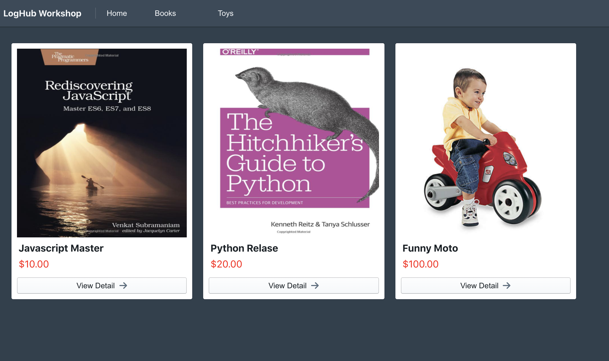

# Centralized Logging Workshop

Getting started with [Centralized Logging workshop](https://awslabs.github.io/log-hub/en/workshop/introduction/). If you have any issues for this workshop, please submit issues to the [awslabs/log-hub](https://github.com/awslabs/log-hub/issues).

## Demo Site
This repo contains the Centralized Logging workshop stack, which is a 3-tier e-commerce website with multiple AWS Services and self-built applications.

## Security

See [CONTRIBUTING](CONTRIBUTING.md#security-issue-notifications) for more information.

## License

This library is licensed under the MIT-0 License. See the LICENSE file.